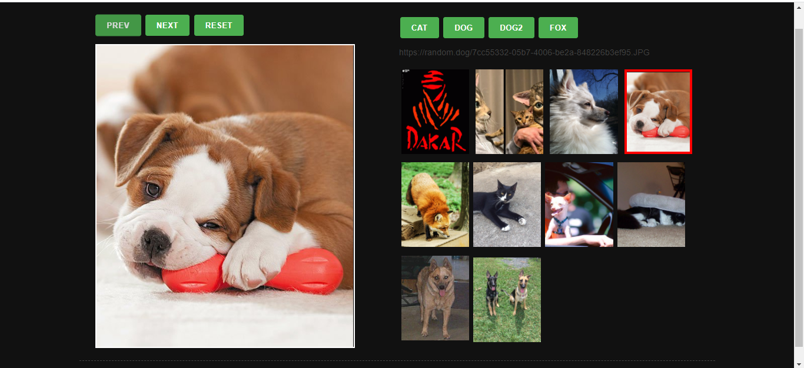

## RandomPhoto

## Install

This project uses [node](http://nodejs.org) and [npm](https://npmjs.com). Go check them out if you don't have them locally installed.

```sh
$ npm install
```
```sh
$ npm run start
```
Open http://localhost:4000 to view it in the browser.

## Usage

Програма додає рандомні фото з чотирьох різних ресурсів, і дозволяє переглядати їх.



## Technologies:
JavaScript, HTML, CSS. Api, Ajax, Function Components
